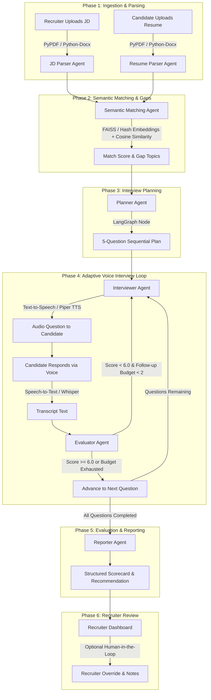
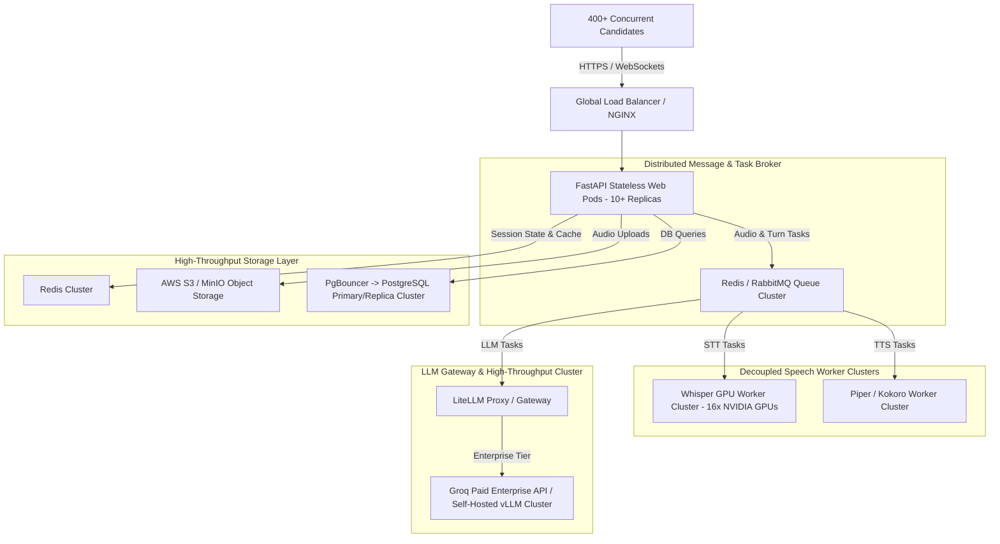

# AI Voice Interview Agent: System Workflow, AI Agents & Model Allocations

This document provides a comprehensive explanation of the end-to-end workflow, architectural design, state machine orchestration, specialized AI agents, **task-specific model allocations**, and **high-concurrency scalability analysis** for the **AI Voice Interview Agent** platform.

---

## 1. High-Level Architectural Workflow

The system operates as an end-to-end autonomous screening platform. It processes job requirements and candidate resumes, conducts interactive voice interviews with real-time feedback loops, evaluates candidate responses against technical domain metrics, and compiles executive-ready hiring reports.



---

## 2. Model Infrastructure & Allocation Strategy

The platform utilizes a **Task-Specific Multi-Model Architecture** ([src/config.py](file:///D:/Interview-Agent/src/config.py) & [src/services/llm.py](file:///D:/Interview-Agent/src/services/llm.py)). Each agent node is paired with an LLM model optimized for its specific requirement (e.g. ultra-low latency for conversational questions vs. high reasoning capacity for evaluation and planning).

### Model Allocation Overview

* **Primary Cloud Inference Provider**: **Groq API** (`https://api.groq.com/openai/v1`) for sub-second response times.
* **Local Fallback Provider**: **Ollama** (`http://localhost:11434`) for offline deployment and privacy.
* **Speech Processing Engines**:
  * **Speech-to-Text (STT)**: Groq Whisper API (`whisper-large-v3`) with local Whisper CLI (`base` / `small`) fallback.
  * **Text-to-Speech (TTS)**: Piper TTS engine using `en_US-lessac-medium` voice model.

---

## 3. Phase-by-Phase Workflow, Agents & AI Models

### Phase 1: Ingestion & Document Parsing
* **Goal**: Convert unstructured PDF, DOCX, or TXT documents into normalized, structured JSON entities for downstream analysis.
* **Workflow**:
  1. Recruiter submits a Job Description (`/jobs` or `/jobs/upload`) or candidate applies with a resume (`/resumes`).
  2. `DocumentParser` ([src/services/parser.py](file:///D:/Interview-Agent/src/services/parser.py)) extracts raw text using `pypdf`, `python-docx`, or standard file I/O.
  3. Structured attributes are extracted using LLM schemas, with regex/heuristic fallback for offline resilience.
* **Agents & Models Used**:
  * 🤖 **Resume Parser Agent (`DocumentParser.parse_entities(doc_type="resume")`)**:
    * **Model Allocation**: `llama-3.3-70b-versatile` (Groq) / `llama3` (Ollama)
    * **Role**: Extracts structured candidate parameters: name, email, tech skills, total experience years, past roles, education, and key project accomplishments.
    * **Output Schema**: `ResumeParsedAttributes` ([src/services/parser.py](file:///D:/Interview-Agent/src/services/parser.py#L14-L25)).
  * 🤖 **JD Parser Agent (`DocumentParser.parse_entities(doc_type="jd")`)**:
    * **Model Allocation**: `llama-3.3-70b-versatile` (Groq) / `llama3` (Ollama)
    * **Role**: Extracts job requirements: target role title, primary tech stack, minimum experience required, core responsibilities, and preferred qualifications.
    * **Output Schema**: `JDParsedAttributes` ([src/services/parser.py](file:///D:/Interview-Agent/src/services/parser.py#L27-L36)).

---

### Phase 2: Semantic Matching & Skill Gap Analysis
* **Goal**: Measure candidate-job compatibility and highlight technical skill gaps to guide the interview.
* **Workflow**:
  1. `SemanticMatcher` ([src/services/vector_store.py](file:///D:/Interview-Agent/src/services/vector_store.py)) receives parsed resume and JD attributes.
  2. Conducts a two-stage matching process:
     * **Stage A (Exact/Token Matching)**: Performs direct string and normalized token set matching between candidate skills and required tech stack.
     * **Stage B (Vector Embedding Matching)**: Generates 128-dimensional embeddings via Ollama (or deterministic SHA-256 hash fallback) and computes Cosine Similarity for missing skills.
  3. Calculates an overall match percentage (`overall_percentage`) and determines if the candidate qualifies for screening (`proceed_to_next_round`).
* **Agent & Models Used**:
  * 🤖 **Semantic Matching Agent (`SemanticMatcher.match_resume_to_jd`)**:
    * **Model Allocation**: Ollama Vector Embedding Model (`nomic-embed-text` / SHA-256 128D Deterministic Fallback Vector) + Cosine Similarity
    * **Role**: Evaluates skill overlaps, isolates skill gaps, and recommends targeted technical probe areas for the interview.
    * **Output Schema**: `MatchDetails` ([src/schemas/resumes.py](file:///D:/Interview-Agent/src/schemas/resumes.py)).

---

### Phase 3: Interview Planning
* **Goal**: Build a personalized 5-question interview plan based on candidate project work and JD expectations.
* **Workflow**:
  1. Session creation (`POST /interviews/sessions`) initializes `InterviewState` ([src/agents/state.py](file:///D:/Interview-Agent/src/agents/state.py)).
  2. `PlannerNode` ([src/agents/nodes/planner.py](file:///D:/Interview-Agent/src/agents/nodes/planner.py)) executes as the initial node in the **LangGraph state machine**.
  3. It analyzes the parsed resume and JD to generate a structured 5-question queue with topic labels and expected keywords.
* **Agent & Models Used**:
  * 🤖 **Interview Planner Agent (`PlannerNode`)**:
    * **Model Allocation**: `llama-3.3-70b-versatile` (Groq via `PLANNER_MODEL`) / `llama3` (Ollama)
    * **Reasoning**: Requires high analytical capacity to compare complex resumes against technical JD specifications.
    * **Output Schema**: `InterviewPlanResponse` ([src/agents/nodes/planner.py](file:///D:/Interview-Agent/src/agents/nodes/planner.py#L18-L23)).

---

### Phase 4: Adaptive Voice Interview Execution (Turn-by-Turn Q&A Loop)
* **Goal**: Conduct an interactive voice screening interview with dynamic follow-up capabilities.
* **Workflow**:
  1. **TTS Output**: The current question text is converted into voice audio using `LocalSpeechService.synthesize_speech()` ([src/services/speech.py](file:///D:/Interview-Agent/src/services/speech.py)) via local Piper TTS.
  2. **Candidate Response & STT**: The candidate answers via microphone (`POST /interviews/{id}/turns`). Audio is transcribed using `LocalSpeechService.transcribe_audio()`.
  3. **Evaluation**: `EvaluatorNode` scores the response based on keyword coverage and depth.
  4. **Adaptive Routing**: `route_after_evaluation` ([src/agents/graph.py](file:///D:/Interview-Agent/src/agents/graph.py#L56-L83)) determines whether to:
     * Trigger an **Adaptive Follow-up** (if turn score < 6.0/10 and follow-up budget < 2).
     * Advance to the **Next Planned Question** (if answer is satisfactory or follow-up limit reached).
* **Agents & Models Used**:
  * 🎙️ **Speech-to-Text (STT) Engine**:
    * **Cloud Model**: Groq Whisper API (`whisper-large-v3`)
    * **Local Fallback**: Local Whisper CLI (`base` / `small` model)
  * 🔊 **Text-to-Speech (TTS) Engine**:
    * **Voice Model**: Piper TTS (`en_US-lessac-medium`)
  * 🤖 **Interviewer Agent (`InterviewerNode` in [src/agents/nodes/interviewer.py](file:///D:/Interview-Agent/src/agents/nodes/interviewer.py))**:
    * **Model Allocation**: `llama-3.1-8b-instant` (Groq via `INTERVIEWER_MODEL`) / `llama3.2:1b` (Ollama)
    * **Reasoning**: Optimized for fast generation (< 1 sec) of natural, voice-synthesizable follow-up questions to keep real-time audio latency low.
    * **Output Schema**: `FollowUpQuestionResponse`.
  * 🤖 **Evaluator Agent (`EvaluatorNode` in [src/agents/nodes/evaluator.py](file:///D:/Interview-Agent/src/agents/nodes/evaluator.py))**:
    * **Model Allocation**: `llama-3.3-70b-versatile` (Groq via `EVALUATOR_MODEL`) / `llama3.2:1b` (Ollama)
    * **Reasoning**: High reasoning capacity required to grade candidate answers on a 0.0–10.0 scale and extract transcript evidence.
    * **Output Schema**: `EvaluationResponse`.

---

### Phase 5: Final Report Synthesis & Evaluation
* **Goal**: Summarize the full interview session into an executive hiring report.
* **Workflow**:
  1. Once all interview turns are completed or session limits are reached, the state transitions to `ReporterNode` ([src/agents/nodes/reporter.py](file:///D:/Interview-Agent/src/agents/nodes/reporter.py)).
  2. `ReporterNode` compiles the complete transcript, turn scores, and evaluator citations.
  3. Generates structured hiring recommendations and saves an `EvaluationReport` record to PostgreSQL ([src/db/models.py](file:///D:/Interview-Agent/src/db/models.py)).
* **Agent & Models Used**:
  * 🤖 **Reporter Agent (`ReporterNode`)**:
    * **Model Allocation**: `llama-3.3-70b-versatile` (Groq via `REPORTER_MODEL`) / `llama3` (Ollama)
    * **Reasoning**: Evaluates overall transcript evidence, generates aggregate scores, provides hiring recommendations (`hire`, `no_hire`, `follow_up`), and synthesizes executive summaries.
    * **Output Schema**: `ReporterOutputResponse` ([src/agents/nodes/reporter.py](file:///D:/Interview-Agent/src/agents/nodes/reporter.py#L15-L28)).

---

### Phase 6: Recruiter Review & Human-in-the-Loop Override
* **Goal**: Provide recruiters with actionable insights and enable human oversight.
* **Workflow**:
  1. Recruiters view reports via `/reports` endpoints or the React Recruiter Dashboard ([frontend/src](file:///D:/Interview-Agent/frontend/src)).
  2. Dashboards present candidate scores, competency breakdown, evidence highlights, skill gaps, and full conversation transcripts.
  3. **Human-in-the-Loop Override**: Recruiters can submit manual decision overrides (`PATCH /reports/{id}/override`) with custom notes, maintaining human control over hiring decisions.

---

## 4. Complete Matrix of AI Agents & Models

| Agent Name | Phase | Primary Cloud Model (Groq) | Local Fallback Model (Ollama) | Audio / Vector Models | Core Output / Schema |
| :--- | :--- | :--- | :--- | :--- | :--- |
| **Resume Parser Agent** | Phase 1 | `llama-3.3-70b-versatile` | `llama3` | N/A (Regex fallback) | `ResumeParsedAttributes` |
| **JD Parser Agent** | Phase 1 | `llama-3.3-70b-versatile` | `llama3` | N/A (Regex fallback) | `JDParsedAttributes` |
| **Semantic Matching Agent** | Phase 2 | N/A (Cosine Sim) | N/A (Cosine Sim) | `nomic-embed-text` / SHA-256 Hash Vector (128D) | `MatchDetails` |
| **Interview Planner Agent** | Phase 3 | `llama-3.3-70b-versatile` | `llama3` | N/A | `InterviewPlanResponse` |
| **Interviewer Agent** | Phase 4 | `llama-3.1-8b-instant` | `llama3.2:1b` | Piper TTS (`en_US-lessac-medium`) | `FollowUpQuestionResponse` |
| **Speech Transcriber (STT)**| Phase 4 | `whisper-large-v3` (Groq) | Local Whisper (`base` / `small`) | Whisper STT Model | Transcript Text |
| **Evaluator Agent** | Phase 4 | `llama-3.3-70b-versatile` | `llama3.2:1b` | N/A | `EvaluationResponse` |
| **Reporter Agent** | Phase 5 | `llama-3.3-70b-versatile` | `llama3` | N/A | `ReporterOutputResponse` |

---

## 5. State Machine Routing Logic (LangGraph)

The interview progression is orchestrated via a state graph defined in [src/agents/graph.py](file:///D:/Interview-Agent/src/agents/graph.py):

```text
[START] -> planner -> interviewer <---> evaluator
                             |              |
                             |       (route_after_evaluation)
                             |              |
                             +----- increment_index <----+
                                          |
                                (route_after_increment)
                                          |
                                      reporter -> [END]
```

### Conditional Edge Rules:
1. **`route_after_evaluation`**:
   * If `last_turn.score < 6.0` **AND** `follow_ups_asked < 2`: Routes back to `interviewer` to generate an adaptive follow-up question.
   * Else: Routes to `increment_index` to move to the next topic.
2. **`route_after_increment`**:
   * If `current_question_index < total_questions` **AND** `total_turns < 5`: Routes to `interviewer` for the next planned question.
   * Else: Routes to `reporter` to close the interview and build the final report.

---

## 6. High-Concurrency Scalability & Load Analysis (400+ Simultaneous Candidates)

### ⚠️ Current Single-Node Baseline Limitations
In its current **single-server baseline configuration**, the system **cannot** handle 400 simultaneous active candidates smoothly. Running 400 active screening sessions at once would encounter 4 major performance bottlenecks:

1. **Local Speech Processing Subprocess Spikes (Whisper & Piper)**:
   * 400 parallel candidates answering simultaneously would trigger 400 concurrent local Whisper STT and 400 Piper TTS CLI subprocesses. This will exhaust server CPU/RAM, leading to Out-Of-Memory (OOM) crashes and latency spikes exceeding 60+ seconds.
2. **LLM Provider Rate Limits (Groq / Ollama)**:
   * 400 candidates submitting turns every 15–30 seconds generate **800 to 1,600 LLM API calls per minute**. Standard Groq API tiers enforce strict Rate Limits (e.g. 30–100 Requests/Min), causing `429 Too Many Requests` errors. Local Ollama instances process requests sequentially (`OLLAMA_NUM_PARALLEL` defaults to 1–4), queueing requests indefinitely.
3. **Database Connection Pool Exhaustion**:
   * The default SQLAlchemy async pool size is 5 connections + 10 overflow. 400 concurrent HTTP requests competing for 15 DB connections will throw `QueuePool limit reached` timeout exceptions.
4. **Local Ephemeral Disk I/O**:
   * Concurrent read/write of hundreds of WAV audio files per second to `./temp_audio` and `./tts_output` creates severe disk I/O locking on single storage mounts.

---

### 🚀 Production Enterprise Scaling Architecture (To Support 400+ Concurrent Candidates)

To comfortably support **400–1,000+ simultaneous voice screening candidates** with < 3s latency, the following distributed architecture must be deployed:



### Key Scaling Upgrades Required:
1. **Asynchronous Worker Offloading**: Decouple Speech-to-Text (STT) and Text-to-Speech (TTS) into background worker pools (Celery / Ray) with GPU acceleration (NVIDIA A10G / L4 GPUs).
2. **WebSocket / WebRTC Streaming**: Transition from HTTP POST polling to WebSockets or WebRTC for low-latency bidirectional audio streaming.
3. **Cloud Object Storage**: Replace local disk folders (`./temp_audio`, `./tts_output`) with AWS S3 or MinIO.
4. **Connection Pooling & Read Replicas**: Deploy **PgBouncer** in front of PostgreSQL to handle 1,000+ concurrent connections gracefully.
5. **Enterprise LLM Gateway**: Route LLM traffic through a LiteLLM Proxy gateway with round-robin fallback models to bypass single-provider rate limits.

---

## 7. Technology Stack Summary

* **Backend & API Framework**: FastAPI (Python 3.11+)
* **State Machine & Agent Orchestration**: LangGraph & LangChain
* **LLM Engine**: Multi-Model Setup via Groq API (`llama-3.3-70b-versatile`, `llama-3.1-8b-instant`) / Ollama (`llama3`, `llama3.2`)
* **Speech Processing**: Groq Whisper (`whisper-large-v3`) / Local Whisper CLI (STT) + Local Piper (`en_US-lessac-medium`) (TTS)
* **Database**: PostgreSQL (Relational schema via SQLAlchemy Async)
* **Vector Embeddings**: FAISS & Hash Fallback Vectors
* **Frontend**: React (Vite, TailwindCSS / Custom CSS)
