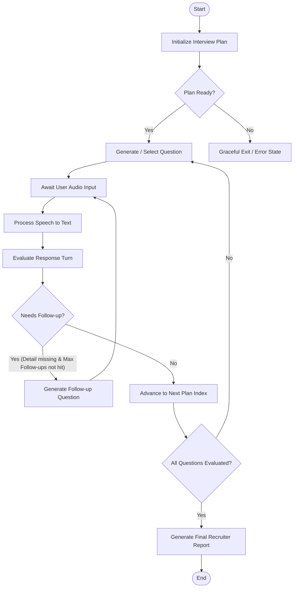

# System Architecture Blueprint: AI Voice Interview Agent

This document defines the technical architecture for the AI Voice Interview Agent. It translates the product requirements ([SPEC.md](file:///D:/Interview-Agent/SPEC.md)) and system design guidelines ([DESIGN.md](file:///D:/Interview-Agent/DESIGN.md)) into a concrete implementation plan, ensuring strict alignment with the principles in the [CONSTITUTION.md](file:///D:/Interview-Agent/CONSTITUTION.md).

---

## 1. Directory Structure

A modular, clean, and testable workspace directory structure designed to separate concern layers: API, business logic (Services), state orchestration (Agents), data access (Database Models), and verification (Tests).

```text
D:/Interview-Agent/
├── .env.example                # Template for environment variables (DB credentials, Local LLM URLs)
├── README.md                   # Getting started and setup guide
├── SPEC.md                     # Product Specification
├── DESIGN.md                   # High-Level Architecture Design
├── CONSTITUTION.md             # Development Principles & Standards
├── docker-compose.yml          # Local infrastructure orchestration (PostgreSQL, Ollama)
├── pyproject.toml              # Project dependencies, packaging, and linters (Poetry/Black/Flake8/Mypy)
├── src/                        # Main application codebase
│   ├── __init__.py
│   ├── main.py                 # FastAPI application entrypoint and lifecycle events
│   ├── config.py               # Application configuration parsing (Pydantic Settings)
│   ├── api/                    # FastAPI request handling layer
│   │   ├── __init__.py
│   │   ├── router.py           # Combined API router mapping all endpoints
│   │   ├── auth.py             # Recruiter authentication & JWT endpoints
│   │   ├── job_descriptions.py # Job Description upload, listing, and processing endpoints
│   │   ├── resumes.py          # Candidate resume upload and parsing endpoints
│   │   ├── interviews.py       # Voice session creation, websocket stream, and status endpoints
│   │   └── reports.py          # Recruiter reports, evaluations, and override endpoints
│   ├── core/                   # Shared infrastructure and platform utilities
│   │   ├── __init__.py
│   │   ├── database.py         # SQLAlchemy engine setup and db session lifecycle
│   │   ├── security.py         # Password hashing and JWT generation
│   │   ├── exceptions.py       # Custom exception definitions and FastAPI handlers
│   │   └── logging.py          # Auditable, structured JSON logging setup
│   ├── db/                     # Database access layer
│   │   ├── __init__.py
│   │   ├── base.py             # Declarative base class for models
│   │   └── models.py           # PostgreSQL/SQLAlchemy ORM schemas
│   ├── schemas/                # Data serialization & validation layer (Pydantic)
│   │   ├── __init__.py
│   │   ├── auth.py             # User and Auth schema validations
│   │   ├── job_descriptions.py # Job Description payload and response schemas
│   │   ├── resumes.py          # Resume and Match schemas
│   │   ├── interviews.py       # Session configuration, turn, and stream schemas
│   │   └── reports.py          # Score feedback, report summary, and override schemas
│   ├── services/               # Decoupled business logic and third-party integrations
│   │   ├── __init__.py
│   │   ├── parser.py           # Document parsing service (Resume and JD PDF extractor)
│   │   ├── speech.py           # Whisper STT and Piper TTS adapters
│   │   ├── llm.py              # Ollama client and prompt-registry wrapper
│   │   ├── vector_store.py     # FAISS semantic retrieval manager for skills matching
│   │   └── report.py           # Report formatting and PDF generation engine
│   └── agents/                 # LangGraph state machines and conversational brains
│       ├── __init__.py
│       ├── state.py            # LangGraph state schema definition
│       ├── graph.py            # Node wiring, edge transitions, and compiled state machine
│       ├── nodes/              # Action nodes mapping to graph steps
│       │   ├── __init__.py
│       │   ├── planner.py      # Generates custom interview plans from JD-Resume match
│       │   ├── interviewer.py  # Generates adaptive follow-ups & next question
│       │   ├── evaluator.py    # Turn-by-turn answer scoring
│       │   └── reporter.py     # Summarizes entire transcript into candidate report
│       └── prompts/            # Version-controlled prompt repository
│           ├── __init__.py
│           ├── templates.py    # Raw system prompts and structured outputs
│           └── registry.py     # Version tracker & compiler for audit-readiness
└── tests/                      # Automated test suite
    ├── __init__.py
    ├── conftest.py             # Test db fixtures, client mocks, and test environments
    ├── unit/                   # Isolated test cases
    │   ├── test_parser.py      # Assertions on resumes and text extraction
    │   ├── test_speech.py      # Mocks for speech-to-text / text-to-speech engines
    │   └── test_llm.py         # JSON schema consistency checks for Ollama wrapper
    └── integration/            # Multi-component flow validation
        ├── test_api.py         # Test endpoints under simulated request cycles
        └── test_graph.py       # Simulated chat state steps and transitions (LangGraph)
```

---

## 2. PostgreSQL DB Schema Details

A relational schema modeled for scalability, compliance, and human-in-the-loop overrides. Data schemas prioritize privacy by default (e.g., storing candidate credentials securely, separating private candidate entities, and allowing cascade deletions).

```mermaid
erDiagram
    users ||--o{ job_descriptions : "manages"
    job_descriptions ||--o{ interviews : "evaluated_against"
    resumes ||--o{ interviews : "evaluated_for"
    interviews ||--o{ interview_questions : "contains"
    interviews ||--o{ interview_turns : "comprises"
    interviews ||--o| evaluation_reports : "yields"
    interview_questions ||--o{ interview_turns : "targets"
    users ||--o{ audit_logs : "triggers"

    users {
        uuid id PK
        string email UK
        string hashed_password
        string full_name
        timestamp created_at
    }

    job_descriptions {
        uuid id PK
        uuid recruiter_id FK
        string title
        text raw_text
        jsonb parsed_attributes
        timestamp created_at
    }

    resumes {
        uuid id PK
        string candidate_name
        string candidate_email UK
        text raw_text
        jsonb parsed_attributes
        timestamp created_at
    }

    interviews {
        uuid id PK
        uuid job_description_id FK
        uuid resume_id FK
        string status "scheduled / active / completed / evaluated"
        timestamp scheduled_at
        timestamp completed_at
    }

    interview_questions {
        uuid id PK
        uuid interview_id FK
        integer sequence_order
        string topic
        text question_text
        text expected_keywords
        timestamp created_at
    }

    interview_turns {
        uuid id PK
        uuid interview_id FK
        uuid question_id FK
        integer turn_index
        text question_asked
        string question_audio_path
        text response_transcript
        string response_audio_path
        float latency_seconds
        float turn_score
        text score_evidence
        timestamp created_at
    }

    evaluation_reports {
        uuid id PK
        uuid interview_id FK UK
        float overall_score
        string recommendation "hire / no_hire / follow_up"
        text primary_summary
        jsonb details "category scores & evidence breakdown"
        string recruiter_override_recommendation "optional"
        text recruiter_notes "optional"
        uuid reviewer_id FK "optional"
        timestamp reviewed_at "optional"
        timestamp created_at
    }

    audit_logs {
        uuid id PK
        uuid user_id FK
        string action_type "e.g., DELETE_RESUME, MODIFY_SCORE"
        string target_resource_type
        uuid target_resource_id
        jsonb action_metadata
        timestamp created_at
    }
```

### SQLAlchemy Model Contracts (`src/db/models.py`)

Below are SQLAlchemy ORM classes that specify keys, relationships, and data-retention configurations.

```python
import uuid
from datetime import datetime
from typing import Optional, List
from sqlalchemy import String, ForeignKey, Float, Integer, Text, DateTime, JSON, Boolean
from sqlalchemy.orm import DeclarativeBase, Mapped, mapped_column, relationship

class Base(DeclarativeBase):
    pass

class User(Base):
    __tablename__ = "users"
    
    id: Mapped[uuid.UUID] = mapped_column(primary_key=True, default=uuid.uuid4)
    email: Mapped[str] = mapped_column(String(255), unique=True, index=True, nullable=False)
    hashed_password: Mapped[str] = mapped_column(String(255), nullable=False)
    full_name: Mapped[str] = mapped_column(String(255), nullable=False)
    created_at: Mapped[datetime] = mapped_column(DateTime, default=datetime.utcnow)
    
    job_descriptions: Mapped[List["JobDescription"]] = relationship("JobDescription", back_populates="recruiter", cascade="all, delete-orphan")
    audit_logs: Mapped[List["AuditLog"]] = relationship("AuditLog", back_populates="user")


class JobDescription(Base):
    __tablename__ = "job_descriptions"
    
    id: Mapped[uuid.UUID] = mapped_column(primary_key=True, default=uuid.uuid4)
    recruiter_id: Mapped[uuid.UUID] = mapped_column(ForeignKey("users.id"), nullable=False)
    title: Mapped[str] = mapped_column(String(255), nullable=False)
    raw_text: Mapped[str] = mapped_column(Text, nullable=False)
    parsed_attributes: Mapped[dict] = mapped_column(JSON, nullable=False)  # Skills, requirements
    created_at: Mapped[datetime] = mapped_column(DateTime, default=datetime.utcnow)
    
    recruiter: Mapped["User"] = relationship("User", back_populates="job_descriptions")
    interviews: Mapped[List["Interview"]] = relationship("Interview", back_populates="job_description", cascade="all, delete-orphan")


class Resume(Base):
    __tablename__ = "resumes"
    
    id: Mapped[uuid.UUID] = mapped_column(primary_key=True, default=uuid.uuid4)
    candidate_name: Mapped[str] = mapped_column(String(255), nullable=False)
    candidate_email: Mapped[str] = mapped_column(String(255), unique=True, nullable=False)
    raw_text: Mapped[str] = mapped_column(Text, nullable=False)
    parsed_attributes: Mapped[dict] = mapped_column(JSON, nullable=False)  # Skills, experience
    created_at: Mapped[datetime] = mapped_column(DateTime, default=datetime.utcnow)
    
    interviews: Mapped[List["Interview"]] = relationship("Interview", back_populates="resume", cascade="all, delete-orphan")


class Interview(Base):
    __tablename__ = "interviews"
    
    id: Mapped[uuid.UUID] = mapped_column(primary_key=True, default=uuid.uuid4)
    job_description_id: Mapped[uuid.UUID] = mapped_column(ForeignKey("job_descriptions.id"), nullable=False)
    resume_id: Mapped[uuid.UUID] = mapped_column(ForeignKey("resumes.id"), nullable=False)
    status: Mapped[str] = mapped_column(String(50), default="scheduled")  # scheduled, active, completed, evaluated
    scheduled_at: Mapped[datetime] = mapped_column(DateTime, default=datetime.utcnow)
    completed_at: Mapped[Optional[datetime]] = mapped_column(DateTime, nullable=True)
    
    job_description: Mapped["JobDescription"] = relationship("JobDescription", back_populates="interviews")
    resume: Mapped["Resume"] = relationship("Resume", back_populates="interviews")
    questions: Mapped[List["InterviewQuestion"]] = relationship("InterviewQuestion", back_populates="interview", cascade="all, delete-orphan")
    turns: Mapped[List["InterviewTurn"]] = relationship("InterviewTurn", back_populates="interview", cascade="all, delete-orphan")
    evaluation_report: Mapped[Optional["EvaluationReport"]] = relationship("EvaluationReport", uselist=False, back_populates="interview", cascade="all, delete-orphan")


class InterviewQuestion(Base):
    __tablename__ = "interview_questions"
    
    id: Mapped[uuid.UUID] = mapped_column(primary_key=True, default=uuid.uuid4)
    interview_id: Mapped[uuid.UUID] = mapped_column(ForeignKey("interviews.id"), nullable=False)
    sequence_order: Mapped[int] = mapped_column(Integer, nullable=False)
    topic: Mapped[str] = mapped_column(String(100), nullable=False)
    question_text: Mapped[str] = mapped_column(Text, nullable=False)
    expected_keywords: Mapped[str] = mapped_column(Text, nullable=False)
    created_at: Mapped[datetime] = mapped_column(DateTime, default=datetime.utcnow)
    
    interview: Mapped["Interview"] = relationship("Interview", back_populates="questions")
    turns: Mapped[List["InterviewTurn"]] = relationship("InterviewTurn", back_populates="question")


class InterviewTurn(Base):
    __tablename__ = "interview_turns"
    
    id: Mapped[uuid.UUID] = mapped_column(primary_key=True, default=uuid.uuid4)
    interview_id: Mapped[uuid.UUID] = mapped_column(ForeignKey("interviews.id"), nullable=False)
    question_id: Mapped[uuid.UUID] = mapped_column(ForeignKey("interview_questions.id"), nullable=False)
    turn_index: Mapped[int] = mapped_column(Integer, nullable=False)
    question_asked: Mapped[str] = mapped_column(Text, nullable=False)
    question_audio_path: Mapped[Optional[str]] = mapped_column(String(512), nullable=True)
    response_transcript: Mapped[Optional[str]] = mapped_column(Text, nullable=True)
    response_audio_path: Mapped[Optional[str]] = mapped_column(String(512), nullable=True)
    latency_seconds: Mapped[Optional[float]] = mapped_column(Float, nullable=True)
    turn_score: Mapped[Optional[float]] = mapped_column(Float, nullable=True)
    score_evidence: Mapped[Optional[str]] = mapped_column(Text, nullable=True)
    created_at: Mapped[datetime] = mapped_column(DateTime, default=datetime.utcnow)
    
    interview: Mapped["Interview"] = relationship("Interview", back_populates="turns")
    question: Mapped["InterviewQuestion"] = relationship("InterviewQuestion", back_populates="turns")


class EvaluationReport(Base):
    __tablename__ = "evaluation_reports"
    
    id: Mapped[uuid.UUID] = mapped_column(primary_key=True, default=uuid.uuid4)
    interview_id: Mapped[uuid.UUID] = mapped_column(ForeignKey("interviews.id"), unique=True, nullable=False)
    overall_score: Mapped[float] = mapped_column(Float, nullable=False)
    recommendation: Mapped[str] = mapped_column(String(50), nullable=False)  # hire, no_hire, follow_up
    primary_summary: Mapped[str] = mapped_column(Text, nullable=False)
    details: Mapped[dict] = mapped_column(JSON, nullable=False)  # Rubric score breakdown
    
    # Recruiter override / Human-in-the-Loop fields
    recruiter_override_recommendation: Mapped[Optional[str]] = mapped_column(String(50), nullable=True)
    recruiter_notes: Mapped[Optional[str]] = mapped_column(Text, nullable=True)
    reviewer_id: Mapped[Optional[uuid.UUID]] = mapped_column(ForeignKey("users.id"), nullable=True)
    reviewed_at: Mapped[Optional[datetime]] = mapped_column(DateTime, nullable=True)
    created_at: Mapped[datetime] = mapped_column(DateTime, default=datetime.utcnow)
    
    interview: Mapped["Interview"] = relationship("Interview", back_populates="evaluation_report")


class AuditLog(Base):
    __tablename__ = "audit_logs"
    
    id: Mapped[uuid.UUID] = mapped_column(primary_key=True, default=uuid.uuid4)
    user_id: Mapped[Optional[uuid.UUID]] = mapped_column(ForeignKey("users.id"), nullable=True)
    action_type: Mapped[str] = mapped_column(String(100), nullable=False)  # DELETE_DATA, OVERRIDE_SCORE, LOGIN
    target_resource_type: Mapped[str] = mapped_column(String(100), nullable=False)
    target_resource_id: Mapped[Optional[uuid.UUID]] = mapped_column(nullable=True)
    action_metadata: Mapped[dict] = mapped_column(JSON, nullable=True)
    created_at: Mapped[datetime] = mapped_column(DateTime, default=datetime.utcnow)
    
    user: Mapped["User"] = relationship("User", back_populates="audit_logs")
```

---

## 3. FastAPI REST API Endpoints

FastAPI endpoints enforce strong typings and payload validations through Pydantic. Async endpoints are used for standard DB querying, while streaming pipelines handle realtime audio transactions.

### Authentication Endpoints
* **`POST /api/v1/auth/signup`**: Standard recruiter registration.
* **`POST /api/v1/auth/token`**: Generates a JWT access token using OAuth2 standards.

### Job Description (JD) Endpoints
* **`POST /api/v1/jobs`**: Accepts raw text or markdown to generate a structured role specification.
* **`GET /api/v1/jobs`**: List recruiter's managed positions.

### Resume & Matching Endpoints
* **`POST /api/v1/resumes`**: Accepts file uploads (PDF/DOCX), triggers async text parsing, extracts entities, and performs structural semantic matching.
* **`DELETE /api/v1/resumes/{resume_id}`**: Enforces privacy by deleting candidate profiles, raw CV documents, and associated metrics.

### Interview Session Endpoints
* **`POST /api/v1/interviews/sessions`**: Initiates interview configurations. Compiles job criteria and candidate info to build the evaluation base.
* **`WS /api/v1/interviews/{interview_id}/stream`**: Full-duplex websocket endpoint accepting binary chunks of client-speech audio and yielding Piper synthesized voice output.
* **`POST /api/v1/interviews/{interview_id}/turns`**: Standard REST fallback. Candidates send transcript text or audio file directly; returns next interviewer response.

### Human-in-the-Loop Report Endpoints
* **`GET /api/v1/reports/{interview_id}`**: Generates or fetches structured report logs.
* **`PATCH /api/v1/reports/{interview_id}/override`**: Permits authorized recruiters to override recommendations and append assessment notes.

### Pydantic Schema Declarations (`src/schemas/`)

```python
from pydantic import BaseModel, EmailStr, Field
from typing import Optional, List, Dict, Any
from datetime import datetime
import uuid

# --- AUTH SCHEMAS ---
class RecruiterSignup(BaseModel):
    email: EmailStr
    password: str = Field(..., min_length=8, description="Must include numeric & special chars")
    full_name: str

class Token(BaseModel):
    access_token: str
    token_type: str

# --- JOB DESCRIPTION SCHEMAS ---
class JobDescriptionCreate(BaseModel):
    title: str = Field(..., example="Senior Backend Engineer")
    raw_text: str = Field(..., description="Complete copy-paste of the Job Description")

class JobDescriptionResponse(BaseModel):
    id: uuid.UUID
    title: str
    parsed_attributes: Dict[str, Any] = Field(..., description="Extracted core requirements and nice-to-haves")
    created_at: datetime

    class Config:
        from_attributes = True

# --- RESUME SCHEMAS ---
class MatchDetails(BaseModel):
    overall_percentage: float
    matched_skills: List[str]
    gaps_identified: List[str]
    recommended_topics_to_probe: List[str]

class ResumeUploadResponse(BaseModel):
    id: uuid.UUID
    candidate_name: str
    candidate_email: str
    parsed_attributes: Dict[str, Any]
    match_score: MatchDetails

# --- INTERVIEW SESSION SCHEMAS ---
class SessionCreateRequest(BaseModel):
    job_description_id: uuid.UUID
    resume_id: uuid.UUID

class SessionResponse(BaseModel):
    id: uuid.UUID
    status: str
    scheduled_at: datetime

class TurnSubmissionRequest(BaseModel):
    response_text: Optional[str] = None
    response_audio_base64: Optional[str] = None
    latency_seconds: float

class TurnResponse(BaseModel):
    next_question: str
    next_question_audio_base64: Optional[str] = None
    is_last: bool

# --- REPORT & OVERRIDE SCHEMAS ---
class ReportOverrideRequest(BaseModel):
    recruiter_override_recommendation: str = Field(..., pattern="^(hire|no_hire|follow_up)$")
    recruiter_notes: str = Field(..., min_length=10)

class CategoryScore(BaseModel):
    score: float = Field(..., ge=0, le=10)
    evidence: str = Field(..., description="Specific transcript citations justifying the score")

class ReportResponse(BaseModel):
    id: uuid.UUID
    interview_id: uuid.UUID
    overall_score: float
    recommendation: str
    primary_summary: str
    details: Dict[str, CategoryScore]
    recruiter_override_recommendation: Optional[str] = None
    recruiter_notes: Optional[str] = None
    reviewed_at: Optional[datetime] = None

    class Config:
        from_attributes = True
```

---

## 4. LangGraph State Machine Architecture

The conversation flow is managed by a LangGraph state machine. It handles adaptive follow-up logic to probe superficial candidate answers before progressing to the next scheduled question.

### State Schema definition (`src/agents/state.py`)

The shared agent state context carries both history and turn-level details to inform transitions.

```python
from typing import TypedDict, List, Dict, Any, Optional

class QuestionPlan(TypedDict):
    id: str
    topic: str
    question_text: str
    expected_keywords: List[str]
    status: str  # "pending", "asked", "passed", "failed"

class TurnDetail(TypedDict):
    turn_index: int
    question: str
    answer: str
    score: Optional[float]
    evidence: Optional[str]
    follow_ups_asked: int

class InterviewState(TypedDict):
    # Context IDs
    interview_id: str
    candidate_name: str
    job_title: str
    
    # Static Data
    parsed_resume: Dict[str, Any]
    parsed_jd: Dict[str, Any]
    
    # State Orchestration
    questions_plan: List[QuestionPlan]
    current_question_index: int
    turns_history: List[TurnDetail]
    
    # Latency tracking
    last_turn_latency: float
    
    # Evaluation outputs
    overall_recommendation: Optional[str]
    is_completed: bool
```

### Graph Transitions & Node Layout



### Transition Router Rules

The routing logic controls state progression dynamically. If the candidate's last answer does not address essential requirements of the question topic, the system generates up to 2 specific follow-up questions for that topic before moving on.

```python
# Transition Routing Code (Conceptual inside src/agents/graph.py)
MAX_FOLLOW_UPS_PER_TOPIC = 2

def route_after_turn_evaluation(state: InterviewState) -> str:
    """
    Evaluates whether to prompt the user with a follow-up probe 
    or advance the planned question list.
    """
    if not state["turns_history"]:
        return "generate_question"
        
    last_turn = state["turns_history"][-1]
    
    # Retrieve evaluation results from the turn
    turn_score = last_turn.get("score")
    follow_ups_count = last_turn.get("follow_ups_asked", 0)
    
    # Condition 1: Answer was shallow (score below 6/10) and we haven't exhausted follow-up allowance
    if turn_score is not None and turn_score < 6.0 and follow_ups_count < MAX_FOLLOW_UPS_PER_TOPIC:
        return "generate_followup_question"
        
    # Condition 2: Score is satisfactory or follow-up limit exceeded
    # Check if we have remaining questions in the plan
    current_idx = state["current_question_index"]
    if current_idx + 1 < len(state["questions_plan"]):
        return "increment_and_next"
        
    return "finalize_report"
```

---

## 5. Core Class Interfaces

Core component services are built behind clean, type-hinted abstractions to permit easy mocking during tests and alternative provider switches (e.g. swapping Whisper for an external API or replacing Piper with another TTS module).

### A. Document Parser Service

Responsible for extracting raw content from multi-format files and structured metadata matching.

```python
from abc import ABC, abstractmethod
from typing import Dict, Any, BinaryIO

class IDocumentParser(ABC):
    """
    Interface for parsing Resume & Job Description files.
    Ensures decoupled logic from concrete tools like PyPDF2 or python-docx.
    """
    
    @abstractmethod
    def extract_text(self, file_stream: BinaryIO, file_extension: str) -> str:
        """
        Extracts raw unstructured text content from the file stream.
        """
        pass

    @abstractmethod
    def parse_entities(self, raw_text: str) -> Dict[str, Any]:
        """
        Invokes an LLM-assisted parse to return structured entities:
        - Resumes: skills, experience (years), education, past roles.
        - JDs: tech_stack, minimum_experience, core_responsibilities.
        """
        pass
```

### B. Local Speech Service (Whisper & Piper STT/TTS)

Encapsulates speech processing pipelines.

```python
from abc import ABC, abstractmethod
from pathlib import Path

class ISpeechService(ABC):
    """
    Handles local Speech-to-Text (Whisper) and Text-to-Speech (Piper) pipelines.
    Runs locally to preserve privacy and minimize third-party API exposure.
    """
    
    @abstractmethod
    async def transcribe_audio(self, audio_file_path: Path) -> str:
        """
        Transcribes incoming audio file (WAV/MP3) to text using Whisper.
        Returns the transcription string.
        """
        pass

    @abstractmethod
    async def synthesize_speech(self, text: str, output_directory: Path) -> Path:
        """
        Synthesizes spoken audio from text using Piper TTS.
        Saves output WAV file to output_directory and returns absolute Path.
        """
        pass
```

### C. Local LLM Client (Ollama Wrapper)

Interacts with Ollama for text completion and structured extraction, incorporating version-controlled prompt templates.

```python
from abc import ABC, abstractmethod
from typing import Type, TypeVar, Optional, List, Dict, Any
from pydantic import BaseModel

T = TypeVar('T', bound=BaseModel)

class ILLMClient(ABC):
    """
    Wrapper for local LLM (Ollama) interaction. 
    Implements structured JSON generation schema controls.
    """

    @abstractmethod
    async def generate_completion(
        self, 
        prompt: str, 
        system_instruction: Optional[str] = None,
        temperature: float = 0.2
    ) -> str:
        """
        Basic completion request.
        """
        pass

    @abstractmethod
    async def generate_structured_json(
        self, 
        prompt: str, 
        response_schema: Type[T], 
        system_instruction: Optional[str] = None,
        temperature: float = 0.1
    ) -> T:
        """
        Requests completion matching a exact Pydantic BaseModel layout.
        Guarantees explainable outputs (e.g. forced fields like 'evidence').
        """
        pass
```

---

## 6. Compliance & Engineering Constitution Verification

The design implements the policies from `CONSTITUTION.md` through these concrete system features:

| Principle | Architectural Enforcement |
| :--- | :--- |
| **Modular First** | Explicit boundary layer division: FastAPI schemas -> SQLAlchemy ORM -> LangGraph state nodes -> Third-party service wrappers. No tight dependencies. |
| **Explainable Decisions** | Pydantic response structures for evaluations require a `score_evidence` text block alongside numeric scores, ensuring every recommendation references exact quotes from the transcript. |
| **Human-in-the-Loop** | PostgreSQL `evaluation_reports` model includes fields for `recruiter_override_recommendation`, `recruiter_notes`, and audit trails for recruiter overrides. |
| **Privacy by Default** | Cascading foreign keys (`cascade="all, delete-orphan"`) ensure that deleting a resume deletes all corresponding interviews, questions, audio paths, and reports. No orphaned personal identifiable information (PII) is left behind. |
| **Reproducibility** | A prompt version registry `src/agents/prompts/registry.py` enforces prompt version control, linking specific LLM outputs to a prompt template ID. |
| **Reliability** | API-level custom exception wrapper `src/core/exceptions.py` handles speech pipeline timeouts or Ollama errors, converting failures into user-friendly responses or falling back to text-only mode dynamically. |
| **Testability** | Component classes inherit from abstract base interfaces. Tests use mock implementations for Whisper/Piper/Ollama to verify logical paths without requiring hardware execution. |

---

## 7. Execution and Verification Plan

To verify this architecture before code construction begins:

1. **Verify Interface Implementations**: Implement simple file parser tests using mock files under `tests/unit/test_parser.py`.
2. **Verify LangGraph Node Isolation**: Node functions should be tested as standalone pure functions. Given a fixed mock state dictionary, the node should output a predictably modified state.
3. **Verify API Contracts**: Construct tests using `fastapi.testclient.TestClient` against all Pydantic request models to guarantee validation boundaries block incorrect request models immediately.
