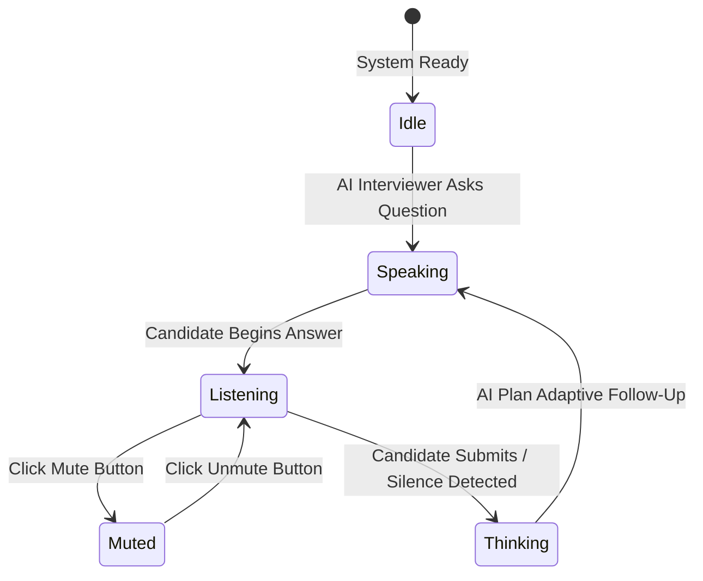
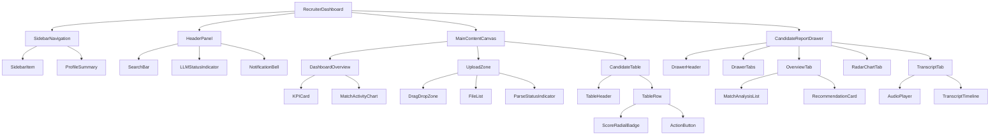
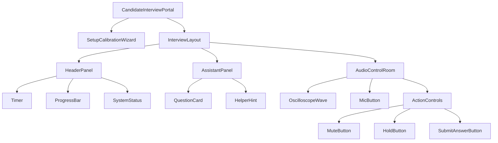

# AI Voice Interview Agent - UI/UX Design Specification

This document details the high-fidelity visual aesthetic, UI component structure, layout, typography, and interactive flows for the **AI Voice Interview Agent**.

Designed for a modern, high-end, and premium user experience, this system leverages a **Glassmorphic Space Dark theme** featuring responsive layouts, glowing gradients, clear micro-animations, and dynamic feedback systems like live voice wave oscilloscopes.

---

## 1. Visual Mockups

Below are the high-fidelity UI design mockups showcasing the premium visual direction, color theme, typography, and card containers.

### Candidate Interview Portal Mockup


### Recruiter Dashboard Mockup


---

## 2. Design System & Style Guide

To establish visual coherence, standard CSS custom properties (variables) must be declared at the root level of the application.

### A. Color Palette
The color system utilizes an ultra-dark background representing "outer space," layered with semi-transparent frosted glass containers, highlighted by custom vibrant cybernetic accents.

```css
:root {
  /* Backgrounds & Canvas */
  --bg-deep-space: #07070F;      /* Main application background */
  --bg-card-glass: rgba(14, 14, 27, 0.65); /* Frosted glass base background */
  --border-glass: rgba(255, 255, 255, 0.08); /* Transparent subtle borders */
  
  /* Primary Cyber Accents */
  --accent-cyan: #00D2FF;        /* Focus, primary interactive buttons, audio highs */
  --accent-purple: #9D4EDD;      /* Secondary accents, branding highlights, active nodes */
  --accent-purple-glow: rgba(157, 78, 221, 0.15);
  
  /* Utility Status Colors */
  --status-emerald: #00F5D4;     /* High-match score, online, voice-active, success */
  --status-emerald-glow: rgba(0, 245, 212, 0.12);
  
  /* Medium score / processing / warning */
  --status-amber: #FF9F1C;
  --status-amber-glow: rgba(255, 159, 28, 0.12);
  
  /* Low score / recording-on / error alert */
  --status-coral: #FF3366;       
  --status-coral-glow: rgba(255, 51, 102, 0.15);
  
  /* Typography Text Elements */
  --text-primary: #F8F9FA;       /* High-contrast labels and headings (90% opacity) */
  --text-secondary: #A0A0B0;     /* Body text, metadata (65% opacity) */
  --text-muted: #606070;         /* Placeholders, disabled states, line borders */

  /* Gradients */
  --gradient-primary: linear-gradient(135deg, var(--accent-cyan) 0%, var(--accent-purple) 100%);
  --gradient-glow: radial-gradient(circle, var(--accent-purple-glow) 0%, transparent 70%);
  --gradient-glass-border: linear-gradient(135deg, rgba(255, 255, 255, 0.12) 0%, rgba(255, 255, 255, 0.02) 100%);
}
```

### B. Typography Tokens
We pair **Outfit** (a clean, geometric display typeface) with **Inter** (a highly readable interface sans-serif). **JetBrains Mono** handles data listings, logs, and speech-to-text text lines.

| Token | Family | Weight | Size (px) | Line Height | Tracking | Usage |
| :--- | :--- | :--- | :--- | :--- | :--- | :--- |
| `--font-h1` | Outfit | 700 (Bold) | `32px` | 1.2 | `-0.02em` | Main titles, Hero metrics |
| `--font-h2` | Outfit | 600 (SemiBold) | `24px` | 1.3 | `-0.01em` | Section headers, Modal titles |
| `--font-h3` | Outfit | 500 (Medium) | `18px` | 1.4 | `0` | Question text, Sub-cards |
| `--font-body` | Inter | 400 (Regular) | `14px` | 1.5 | `0` | Descriptions, Paragraphs |
| `--font-caption` | Inter | 500 (Medium) | `12px` | 1.4 | `0.02em` | Metadata, badges, tags |
| `--font-mono` | JetBrains Mono | 400 (Regular) | `13px` | 1.6 | `0` | Speech transcripts, debug logs |

### C. Glassmorphism Design Token Rules
All cards must implement frosted-glass transparency layers:
```css
.card-glass {
  background: var(--bg-card-glass);
  backdrop-filter: blur(16px) saturate(180%);
  -webkit-backdrop-filter: blur(16px) saturate(180%);
  border: 1px solid var(--border-glass);
  border-radius: 16px;
  box-shadow: 0 8px 32px 0 rgba(0, 0, 0, 0.35);
  transition: transform 0.3s cubic-bezier(0.16, 1, 0.3, 1), 
              border-color 0.3s ease, 
              box-shadow 0.3s ease;
}
```

---

## 3. Recruiter Dashboard Specification

The dashboard provides recruiters with a unified interface to upload job parameters, check candidacy metrics, and review evaluation reports.

### A. Layout Structure & Wireframe
The dashboard operates on a grid layouts structure comprising a fixed **Sidebar Navigation** and a responsive **Main Scrollable Workspace**.

```
+--------------------------------------------------------------------------------------+
| SIDEBAR      | HEADER: [Search Candidate]            LLM Status: (ONLINE)  [Profile] |
|              +-----------------------------------------------------------------------+
| BRAND LOGO   |  KPI SUMMARY CARDS                                                    |
|              |  +-------------+  +-------------+  +-------------+  +-------------+   |
| [Dashboard]  |  | Total JDs   |  | Total Res   |  | Match Rate  |  | Screened    |   |
|              |  | 14          |  | 89          |  | 78%         |  | 54          |   |
| [JDs & Res]  |  +-------------+  +-------------+  +-------------+  +-------------+   |
|              |                                                                       |
| [Candidates] |  +---------------------------------+  +----------------------------+  |
|              |  | JD & RESUME UPLOADER ZONE       |  | PIPELINE STATUS CHART      |  |
| [Reports]    |  | [ Drag & Drop PDF files here ]  |  | Match Distribution         |  |
|              |  |   [ Browse local directory ]    |  | [Chart Visual representation]|  |
| [Settings]   |  +---------------------------------+  +----------------------------+  |
|              |                                                                       |
|              |  CANDIDATE screening overview table                                   |
|              |  +-----------------------------------------------------------------+  |
|              |  | Candidate Name | Applied Role    | Match Score | Status | Action|  |
|              |  |----------------|-----------------|-------------|--------|-------|  |
|              |  | Jane Doe       | Sr. Devops Eng  | 92% (Mint)  | Screen | [View]|  |
|              |  | John Smith     | React Architect | 65% (Amber) | In-Prg | [View]|  |
|              |  +-----------------------------------------------------------------+  |
+--------------+-----------------------------------------------------------------------+
```

### B. Core Features & Sub-Views

#### 1. Multi-Step Uploader Component
* **Zone**: Dynamic dropzone supporting multiple file types (`.pdf`, `.docx`).
* **Active Drag State**: Outline turns to a glowing `gradient-primary` with `transform: scale(1.01)`.
* **Parsing Feed**: Shows list of uploaded files, size, parsing progress indicators (e.g. "Processing JSON extraction...").
* **Post-Upload Match Trigger**: Instantly prompts LLM Matching Agent on upload completion, showing matching status bar.

#### 2. Candidate Matching Table
* **Structure**: Grid table showing candidate profile, specific role applied, match metrics.
* **Match Score Visual**: Circular progress radial. Scores $\ge 80\%$ are glowing Mint Green (`--status-emerald`), $60\% - 79\%$ are glowing Amber (`--status-amber`), $< 60\%$ are Crimson Coral (`--status-coral`).
* **Action Toggle**: Clicking "View Report" slides in the **Candidate Evaluation Drawer**.

#### 3. Recruiter Evaluation Drawer (Slides-in from Right)
* **Design**: Takes 40% width. Fully glassmorphic panel overlay.
* **Header**: Profile avatar, Candidate name, applied role, and large radial score indicator.
* **Body Section Tab System**:
  * **Tab 1: Highlights & Gap Analysis**: Breakdown of "Evidence Found" (what matching items are present) vs "Gaps Identified" (missing skillsets / requirements).
  * **Tab 2: Skills Radar**: A SVG radar map displaying rating across Technical Skills, System Design, Communication, Experience.
  * **Tab 3: Interview Recording & Transcript**:
    * Clean audio playback widget styled with cyber colors.
    * Interactive timestamped transcript logs.
    * Question bubbles (aligned left, purple tint) and candidate speech bubbles (aligned right, cyan tint). Clicking any text bubble skips audio directly to that question.

---

## 4. Candidate Interview Portal Specification

The portal is designed to minimize candidate anxiety, providing a clear screen layout, straightforward setups, and direct speech feedback.

### A. Calibration/Setup Wizard
Before entering the interview, candidates are guided through a multi-step setup overlay:
1. **Device Permission**: Prompts for microphone access in browser.
2. **Audio Input Selection**: Sleek drop-down listing available microphones.
3. **Volume Sensitivty Check**: Bar indicator that fills green/cyan on vocal test ("Say 'Ready' to test input").
4. **Speech-to-text Ping**: Fast backend test to ensure Whisper transcription is receiving packets.

### B. Live Portal Layout
A centered single-card configuration optimized for distraction-free verbal interactions.

```
+--------------------------------------------------------------------------------------+
| BRAND LOGO                                         Connection: (GOOD)  Question 3/5  |
+--------------------------------------------------------------------------------------+
|                                                                                      |
|                                                                                      |
|                     +------------------------------------------+                     |
|                     | ASSISTANT: CURRENT QUESTION CARD         |                     |
|                     |                                          |                     |
|                     | "Describe a complex system bug you       |                     |
|                     |  resolved and how you diagnosed it."     |                     |
|                     |                                          |                     |
|                     | [Focus areas: Tech Stack, Troubleshooting] |                     |
|                     +------------------------------------------+                     |
|                                                                                      |
|                                     ~ ~ ^ ~ ~                                        |
|                                   ~ ~ / \ ~ ~                                        |
|                              LIVE INTERACTIVE AUDIO WAVE                             |
|                                                                                      |
|                        [Mute Mic]   (( RECORDING ))  [Submit Answer]                 |
|                                                                                      |
|                                                                                      |
+--------------------------------------------------------------------------------------+
```

### C. Live Speech Oscilloscope Wave
Instead of a simple static spinner, a central interactive oscilloscope responds dynamically to audio inputs.

#### Audio Wave Design Specs
- **Technology**: Web Audio API `AnalyserNode` connected to a `<canvas>` element (or dynamic SVG bezier-curves).
- **Default Visual**: Double-sine wave paths intersecting at the center. Line width: `2px`.
- **Responsive Animations**:
  ```javascript
  // Dynamic scaling example based on frequency-domain data
  let amplitude = Math.max(...dataArray) / 255;
  let waveHeight = amplitude * canvas.height;
  ```

#### Five Visual Oscilloscope States



1. **Idle State (Flatline)**:
   * **Visual**: A horizontal glow line centered on screen with slight, rhythmic pixel noise.
   * **Colors**: Soft muted purple (`rgba(157, 78, 221, 0.4)`).
   * **Animation**: Slow sine sweep, very low amplitude ($5px$ height).
2. **AI Speaking State**:
   * **Visual**: Active smooth wave pulsing in perfect synchronization with the output of the Piper Text-To-Speech engine.
   * **Colors**: Deep Purple (`--accent-purple`) morphing into Cyber Cyan (`--accent-cyan`).
   * **Animation**: Crisp, wider peaks, smooth ease-in on word breaks.
3. **Candidate Listening State (Mic Active)**:
   * **Visual**: Real-time frequency response wave. Multiple overlapping neon curves showing high-frequency jitter in response to voice dynamics.
   * **Colors**: Glowing Mint Green (`--status-emerald`).
   * **Animation**: High responsiveness ($0 - 150px$ peak heights), zero-latency scaling based on input volume data.
4. **Muted State**:
   * **Visual**: Flatline with a cross-out icon overlay.
   * **Colors**: Glowing Crimson Coral (`--status-coral`).
   * **Animation**: Frozen horizontal line, subtle red static noise ripple.
5. **Thinking/Processing State**:
   * **Visual**: Dual-spinning glowing orb rings or a rolling phase wave representing LangGraph decision routing.
   * **Colors**: Glowing cyan-violet gradient loop.
   * **Animation**: Wave cycle shifting left-to-right continuously, indicating background computation.

---

## 5. UI/UX Component Hierarchy Trees

### Recruiter Dashboard Component Tree


### Candidate Interview Portal Component Tree


---

## 6. Interactive States & Micro-Animations

### A. Core Interactive State Specifications

| Target Component | State | CSS Properties Affected | Transition Spec / Animation Timing |
| :--- | :--- | :--- | :--- |
| **Sidebar Menu Item** | Hover | `background-color`, `box-shadow` | `all 200ms cubic-bezier(0.4, 0, 0.2, 1)` |
| | Active | `color`, `border-left` | `all 150ms ease-out` |
| **Glass Card (`.card-glass`)** | Hover | `transform`, `border-color`, `box-shadow` | `transform 300ms cubic-bezier(0.16, 1, 0.3, 1), border-color 0.2s ease` |
| **Primary Interactive Button** | Hover | `box-shadow`, `filter: brightness()` | `all 250ms ease-in-out` (neon glow spreads) |
| | Click | `transform: scale()` | `scale(0.97) 50ms` (tactile spring bounce) |
| **Upload Zone Uploader** | DragOver | `border-style`, `background-color`, `transform` | `all 300ms cubic-bezier(0.25, 0.8, 0.25, 1)` |
| **Candidate Row (Table)** | Hover | `background-color` | `background 150ms ease-in` (subtle white tint) |

### B. Micro-Animations & Timing Reference

* **Main Page Transition (Router changes)**:
  * Fade in + slide up:
  ```css
  @keyframes pageFadeInUp {
    from {
      opacity: 0;
      transform: translateY(12px);
    }
    to {
      opacity: 1;
      transform: translateY(0);
    }
  }
  .page-view {
    animation: pageFadeInUp 400ms cubic-bezier(0.16, 1, 0.3, 1) forwards;
  }
  ```

* **Interactive Mic Button Glow**:
  When active and recording, the microphone button pulses outwards to signal voice input capture:
  ```css
  @keyframes recordingPulse {
    0% {
      box-shadow: 0 0 0 0 rgba(255, 51, 102, 0.4);
    }
    70% {
      box-shadow: 0 0 0 16px rgba(255, 51, 102, 0);
    }
    100% {
      box-shadow: 0 0 0 0 rgba(255, 51, 102, 0);
    }
  }
  .mic-button-active {
    animation: recordingPulse 2s infinite ease-in-out;
  }
  ```

* **Question Card Exit/Entry Transition**:
  When moving to the next adaptive question, the question card slides left, fades out, and the new card slides in from the right:
  * Exit: `transform: translateX(-40px); opacity: 0; transition: all 250ms ease-in;`
  * Entry: `transform: translateX(0); opacity: 1; transition: all 350ms cubic-bezier(0.16, 1, 0.3, 1);`
